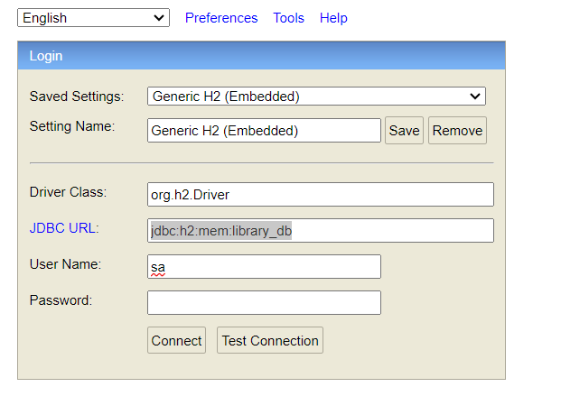

# Library-Management-System
Library Management System (Springboot / H2 DB / Maven / lombok / validation) 

PORT: 3000
H2 DB : http://localhost:3000/h2-console/
driverClass=: org.h2.Driver
jdbc url: jdbc:h2:mem:library_db
username: sa
password: 

TO GET APIS APLLOW IN THE LINK 
https://dark-crescent-975857.postman.co/workspace/personal~761dedc7-98e9-4e45-a220-d0c3cc458898/collection/18352879-0a1baca2-3850-479f-8882-af17565a6b9d?action=share&creator=18352879

