# Library-Management-System
Library Management System (Springboot / H2 DB / Maven / lombok / validation) 

**configrations:**
>PORT: 3000  

>DATABASE :
>>    H2 DB : http://localhost:3000/h2-console/  
>>    driverClass=: org.h2.Driver  
>>    jdbc url: jdbc:h2:mem:library_db  
>>    username: sa  
>>    password:   

  

TO GET APIS BELLOW IN THE LINK  
https://dark-crescent-975857.postman.co/workspace/personal~761dedc7-98e9-4e45-a220-d0c3cc458898/collection/18352879-0a1baca2-3850-479f-8882-af17565a6b9d?action=share&creator=18352879  

**Library Mangment System APIS:**   
>**Book endpoints:**

>>  Get All Books:
>>> http://localhost:3000/api/get-all-books
>>>>

>>  Get Book By ID:
>>> http://localhost:3000/api/get-book?id=5
>>>>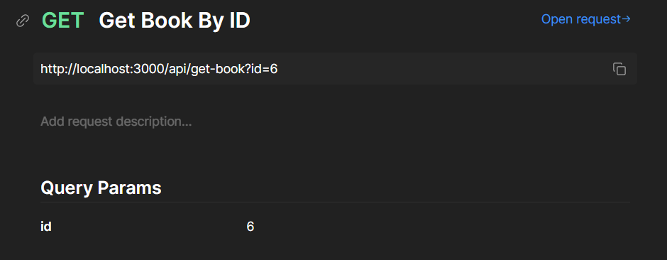

>>  Post book:
>>>http://localhost:3000/api/post-book
>>>>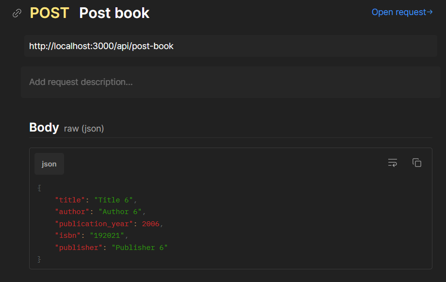

>>  Delete Book:
>>>http://localhost:3000/api/delete-book?id=6
>>>>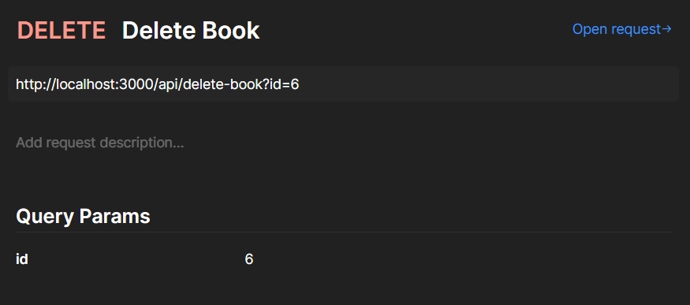

>>  Update Book:
>>>http://localhost:3000/api/put-book
>>>>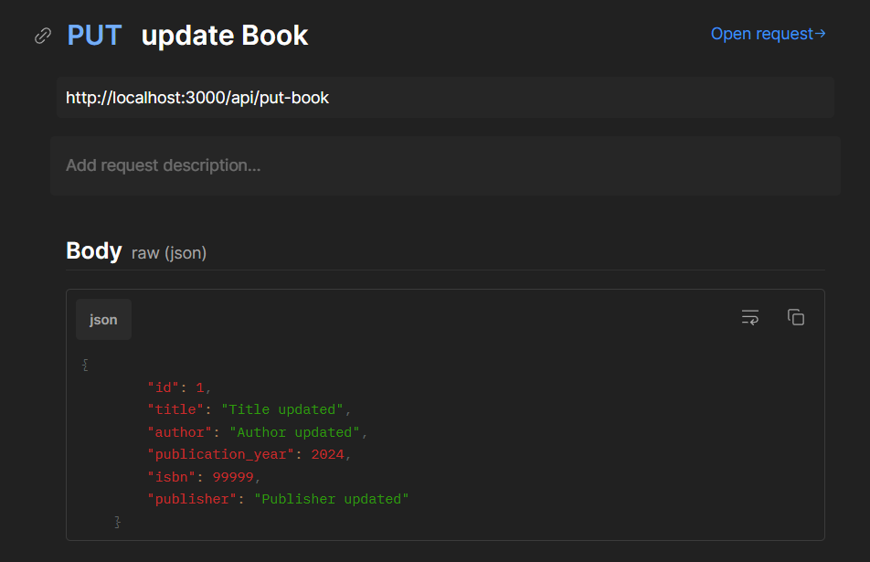

>**Patrons endpoints:**

>>  Get All Patrons:
>>>http://localhost:3000/api/get-all-patrons
>>>>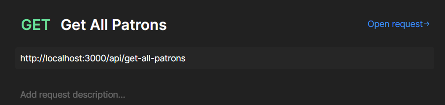

>>  Get Patron by ID:
>>>http://localhost:3000/api/get-patron?id=5
>>>>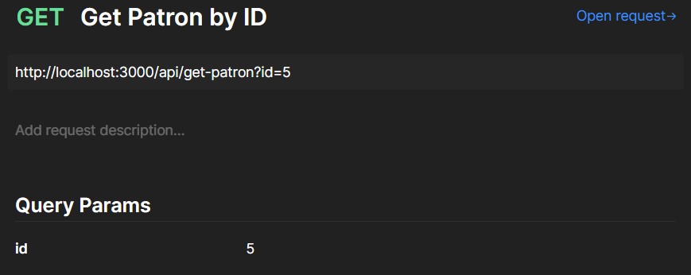

>>  Post Patron:
>>>http://localhost:3000/api/post-patron
>>>>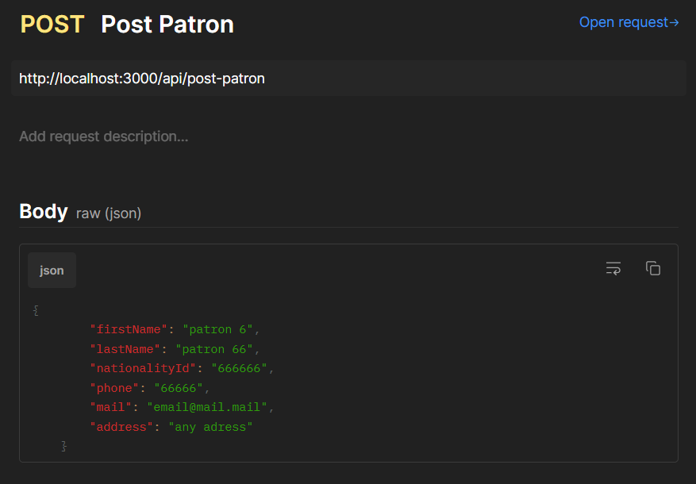

>>  Delete Patron:
>>>http://localhost:3000/api/delete-patron?id=5
>>>>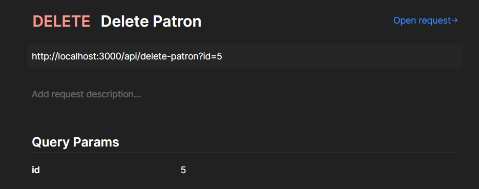

>>  Update Patron:
>>>http://localhost:3000/api/put-patron
>>>>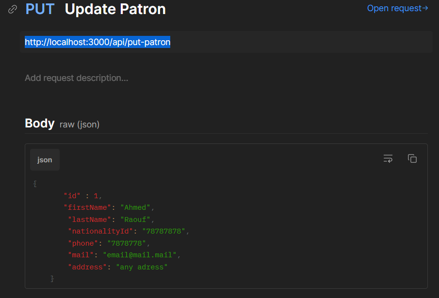

>**Borrowing endpoints:**

>>  Post Borrowing:
>>>http://localhost:3000/api/post-borrowing
>>>>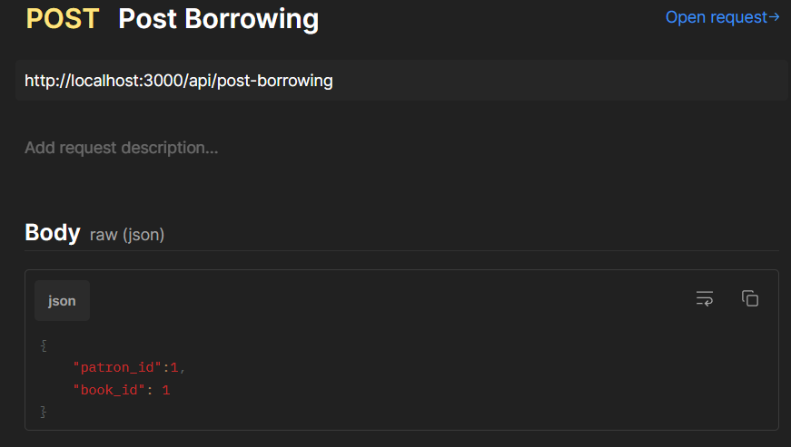

>>  Update Borrowing:
>>>http://localhost:3000/api/put-borrowing
>>>>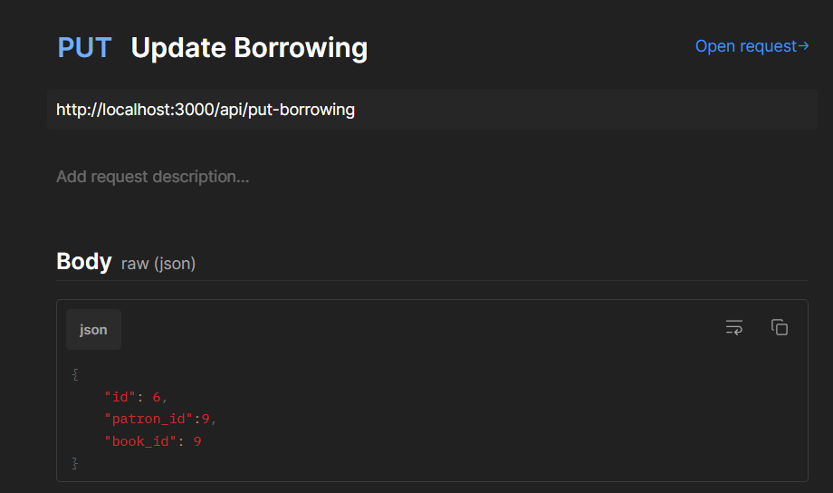